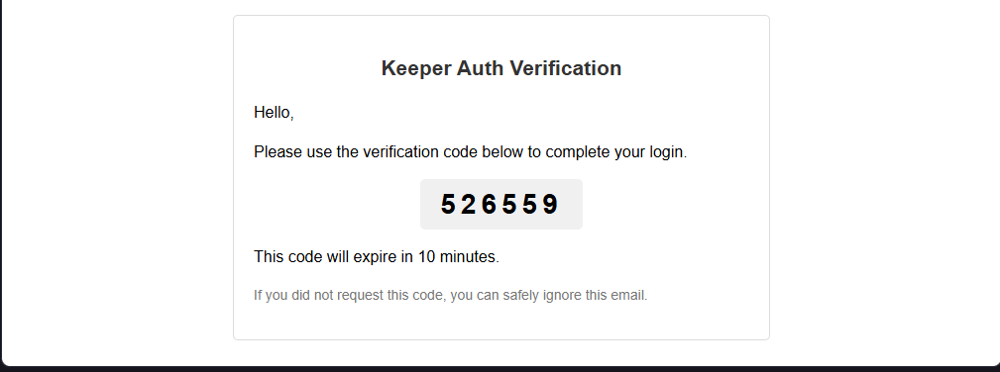

# Keeper Email Validation Service (TypeScript)

An email validation microservice for the Keeper application, built with Node.js and Fastify. It handles the process of verifying user email ownership by sending and validating One-Time Passwords (OTP).

## Email Preview

The following is an example of the verification email sent to the user:

## License

This project is licensed under the MIT License. See the [LICENSE](LICENSE) file for details.